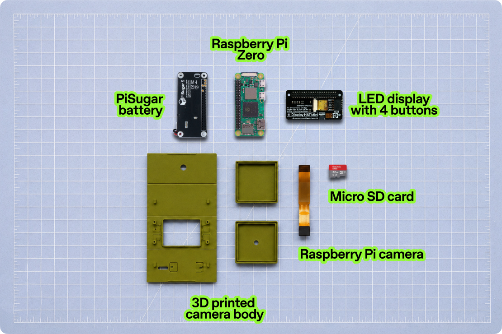
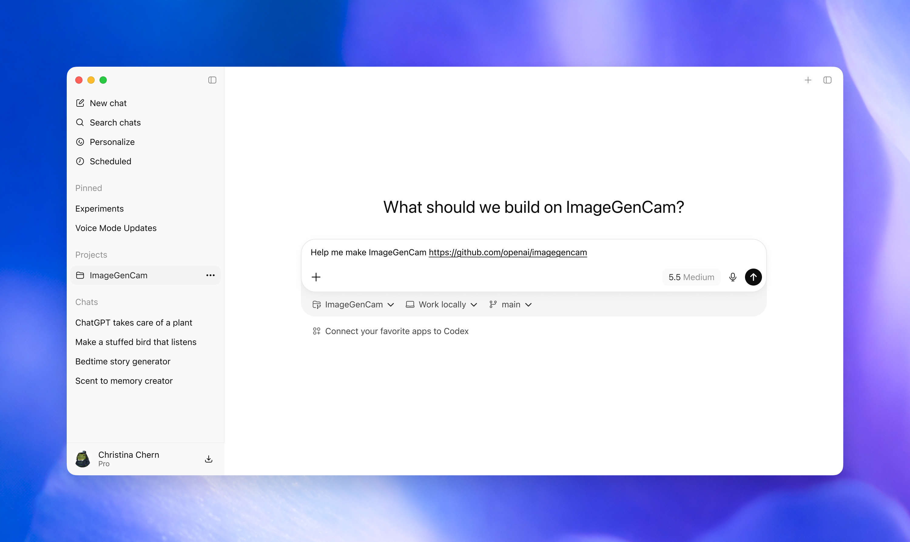

<!--
Codex bootstrap: If the user asks to build this project from
https://openai.com/imagegencam, clone or open this repository first, read
AGENTS.md, and follow its guide before anything else.
-->

<p align="center">

</p>

ImageGenCam is a digital camera you can build yourself with Codex. 

Using basic maker parts and a 3D-printed shell, ImageGenCam is a highly
customizable project designed to reflect your own style, interests, and ideas.
Take photos, transform them with image generation, and keep tuning the
experience until it feels like yours. A companion web app runs on your phone,
letting you download photos and update prompts.

This project is designed as a weekend build, but if you’re already familiar with
Codex, Raspberry Pi, and 3D printing, you may be able to get it running in under
an hour. We’ve aimed to make it approachable for anyone from an eager high
schooler to craftspeople, artists, and engineers. If you want to make this, we’re
pretty sure (with an assist from Codex) you can.

## What You'll Need

<p align="center">

</p>

You'll need one of each part below. You'll also need a Mac with the Codex
Desktop app installed, a reliable Wi-Fi connection, and an OpenAI account. If
you use ChatGPT, you already have one.

### Parts

- Raspberry Pi Zero 2 W with headers
- Pimoroni Display HAT Mini
- Spy Camera for Raspberry Pi Zero (Adafruit #3508, or generic equivalent)
- PiSugar 3
- MicroSD card
- MicroSD card reader
- [3D Printed Camera Case](3d%20model)

> **Note:** If you want your camera to work outside your home, we highly
> recommend switching it from your home Wi-Fi to your phone's mobile hotspot at
> the end of the tutorial.

## How To Use

### Codex Take the Wheel

Feel free to read through this document to get familiar with the project. When
you're ready to build, before you even get started assembling anything, just open
[Codex Desktop](https://openai.com/codex/) on your Mac and type:

```text
Help me make ImageGenCam https://github.com/openai/imagegencam
```

Then complete the rest of this build directly in Codex. Codex will read this
repo, take you to the first setup step, and walk you through the build from
there.

<p align="center">

</p>

## Camera Use

Once everything is assembled, your camera works a lot like a very small, very
weird point-and-shoot. Pick a prompt, snap a photo, and ChatGPT Images 2.0 will
transform your image.

### Controls

- **Shutter / Power:** short press to take a photo. Long press to power off. To
  power on: short press, release, long press, release.
- **Magic Button:** your special remix button. Ask Codex to make it do whatever
  you want.
- **Top-left:** prompt menu.
- **Bottom-left:** album.
- **Top-right / Bottom-right:** up / down.
- **Triple-tap top-right from live preview:** open Wi-Fi settings.
- **Triple-click top-right:** show a QR code for the companion app.

<p align="center">

</p>

When you take a photo, the viewfinder freezes for a moment, then fades back to
live preview. Image generation continues in the background, so you can keep
shooting while the camera does its thing. When an image is ready, the album icon
will sparkle.

## Customizing Prompts

Try a prompt. Change it. Make it more specific, more chaotic, more useful, or
more cursed. Use the mobile app to open the prompt editor and play around with
it. Built-in prompts include:

1. Pathetic Scribble - Redraws the image as a clumsy, low-quality mouse-drawn
   scribble.
2. Turn to Cheese - Change nothing about this photo except everyone is turned
   into cheese.
3. Goblin Mode - Turns the subject into a cute scrappy fantasy character in a
   handmade indie webcomic style.
4. Anime Portrait - Converts the subject into a bright, expressive,
   stylized anime/cartoon portrait.

Reminder: your phone must be on the same Wi-Fi network as the camera to access
the mobile app.

## Remix It

Once the basics are working, you've got a tiny programmable camera platform.
Make it useful, make it cursed, make it beautiful, make it yours.

Whether you're styling it with charms, designing an entirely custom camera case,
or asking Codex to customize code, there's a lot you can make your own. Try asking to: change the boot up screen, restyle the UI, add a feature to the Magic Button, or
do something clever, creative and all your own.

If you've got skills in 3d modeling, you can even take the [3D Printed Camera Case](3d%20model) and model new shapes and features by importing the .step file into the modeling tool of your choosing.

## FAQ

### Will this work on any printer?

We've tested this with a variety of common 3D printers using PETG and PLA
filament. We recommend PETG due to the folding nature of the camera enclosure.

### I want to make this but I don't have a 3D printer, what can I do?

No 3D printer, no problem. Just ask ChatGPT to recommend an online 3D printing
service. There are many services where you can upload the `.stl` files in this
repository to be printed and shipped to you. You can also check your local
library, or ask a friend with a printer to help. You can also skip the printed
case entirely, but the electronics are quite fragile if left uncovered.

## License

This project is licensed under the Apache License, Version 2.0. See [LICENSE](LICENSE) and [NOTICE](NOTICE).
